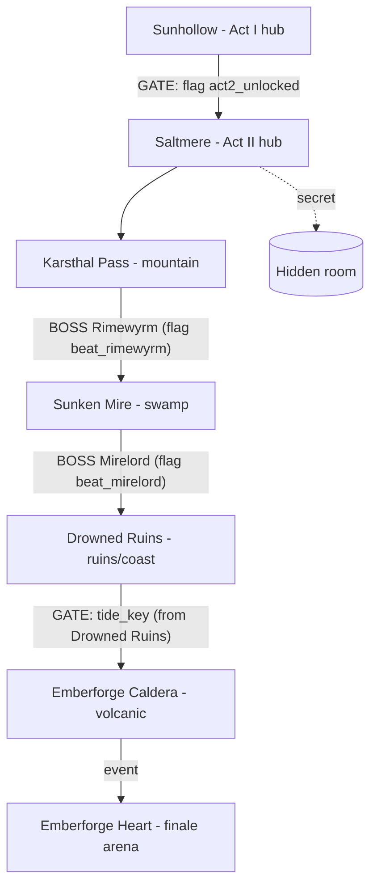

# Sunstone — ACT II: "After the Dawn" (design spec / source of truth)

A full second act unlocked **after** the Act 1 finale: a new hub town + four new
gated regions, each with a unique boss, ending in a new true finale. Built by
three parallel workstreams against this shared spec (agree on every NAME here):

- **ENGINE** — `src/states/battle.js`, `src/states/dialogue.js`, `CONTRACT.md`,
  `verify.mjs`. Adds battle biomes/backgrounds for the new regions and the
  "ending → continue into Act II" hand-off. Does NOT touch data.js or sprites.js.
- **ART** — `src/sprites.js` ONLY. New biome tiles + unique boss/enemy sprites.
- **CONTENT** — `src/data.js` ONLY. All Act II maps, NPCs, quests, dialogues,
  enemies (stats), items, the unlock gateway, gating, and the finale + endings.

Everything builds in parallel; references are inert until each lands and we
integrate. Validate at the end with `verify.mjs`, `smoke.mjs`, `vite build`.

---

## 1. The unlock (how Act II begins)

Act 1's **light-path** endings (`dawn`, `radiant`, `redemption`) currently call
`ending:KEY`, and `dialogue.js` shows the ending screen then `clearTo("title")`.

Change (ENGINE, in `dialogue.js`): those three endings become **continuing**
chapter endings. After the ending screen, on confirm:
1. set `G.story` flag **`act2_unlocked`** = true (and keep `sunstone_complete`),
2. move the player to Sunhollow: `player.map = "town"`, position at `town.spawn`,
3. `G.saveGame(...)`, then `G.clearTo("overworld")` (NOT title).
- Footer text for continuing endings reads **"- TO BE CONTINUED -"** (not
  "- THE END -").
- The `eclipse` (villain) ending stays a true ending → title (no Act II).
- Implement via per-ending data in the `ENDINGS` map, e.g.
  `dawn: { ..., continue: { flag: "act2_unlocked", map: "town" } }`. Engine reads
  `town.spawn` from `G.content.maps.town`.

Act II's NEW finale endings (`tide_dawn`, and optionally `tide_fall`) are normal
true endings → title (no `continue`). ENGINE adds them to `ENDINGS`; CONTENT
calls `ending:tide_dawn` etc. from the finale dialogue.

In Sunhollow (CONTENT, `data.js`): add a gateway to Act II that only works once
`act2_unlocked` is set — a new transition on the town's edge to the Act II hub,
using the gated-transition grammar:
`{ ..., type:"transition", to:"saltmere", dir, requires:"flag:act2_unlocked", blocked:"gate_act2" }`,
plus a new NPC (e.g. a messenger/envoy) near it, `requires:"flag:act2_unlocked"`,
who explains the new threat. Before unlock, `gate_act2` says nothing stirs there
yet. Edit the `town` map rows to add the path/exit tile (keep rows rectangular,
keep all existing town content + reachability intact).

---

## 2. World graph (Act II)

### Map ids → battle biome (ENGINE `biomeFor` + `drawBattleBg` must map these)
| Map id | Region | Biome key |
|---|---|---|
| `saltmere` | Act II hub town | `town` |
| `saltmere_inn` (interior) | hub inn/shop | `town` |
| `karsthal` | Mountain pass | `mountain` |
| `sunken_mire` | Swamp | `swamp` |
| `drowned_ruins` | Sunken ruins / coast | `ruins` |
| `emberforge` | Volcanic caldera | `volcanic` |
| `emberforge_heart` | Final arena | `volcanic` |

ENGINE: extend `biomeFor` to return `mountain` for ids containing
`karsthal`/`mountain`/`pass`/`snow`; `swamp` for `mire`/`swamp`/`bog`; `ruins`
for `ruins`/`drowned`/`sunken`; `volcanic` for `ember`/`forge`/`caldera`/`magma`.
Add the four new palettes + silhouette branches to `drawBattleBg` (mountain =
snowy peaks; swamp = dead trees/fog; ruins = broken columns over water; volcanic
= lava glow + jagged rock). Keep the existing four biomes working.

Gating uses the EXISTING mechanics (already in the engine):
- **Boss gates**: a gated `transition` with `requires:"flag:beat_X"` +
  `blocked:"gate_X"`; the blocked dialogue runs `battle:X` and sets the flag on
  victory (see Act 1's `gate_thornjaw`).
- **Item/progression gates**: `requires:"item:tide_key"` or `requires:"flag:..."`.

---

## 3. Shared NAMES (all three workstreams must use these exactly)

### New tiles (ART draws 16×16 in sprites.js; CONTENT adds `tileDefs` solidity)
| Tile name | Walkable? | Notes |
|---|---|---|
| `snow` | yes (solid:false) | mountain ground |
| `ice` | yes (solid:false) | frozen patches |
| `snowdrift` | no (solid:true) | piled snow/rock |
| `pine` | no (solid:true) | snow-laden conifer |
| `bog` | yes (solid:false) | murky swamp ground |
| `mud` | yes (solid:false) | walkable mud |
| `bog_water` | no (solid:true) | swamp water |
| `reeds` | no (solid:true) | cattails/reeds |
| `ruin_floor` | yes (solid:false) | cracked flagstones |
| `ruin_wall` | no (solid:true) | broken masonry |
| `coral` | no (solid:true) | coastal coral/rock |
| `ash` | yes (solid:false) | volcanic ash ground |
| `ember_rock` | no (solid:true) | glowing-seam rock |

Reuse existing tiles freely too (rock, tree, water, lava, floor_stone, pillar,
brazier, crystal, rubble, sand, door, door_dungeon, sign, chest, etc.). CONTENT
MUST add a `tileDefs` entry for each NEW tile with the solidity above. ART MUST
make `sprites.tile(name)` return a fitting 16×16 for each new name.

### New enemy sprites (ART draws via `E(name,w,h,fn)`; CONTENT adds stats)
- **Bosses (unique sprite + unique-feeling moveset, like Thornjaw):**
  `rimewyrm` (frost serpent/wyrm), `mirelord` (bog horror / hydra-toad),
  `tidewrought` (drowned colossus), `magmaroth` (cinder tyrant — Act II final boss).
- **Signature regulars (ART; create as many as feasible):** `frost_wolf`,
  `ice_wisp`, `bog_toad`, `leech`, `drowned`, `siren`, `magma_hound`, `ash_wraith`.
- CONTENT may REUSE existing enemy sprites for any filler enemy not given a new
  sprite (e.g. reuse `skeleton`→drowned, `wraith`→wisp, `specter`, `golem`,
  `dire_wolf`). Do NOT invent sprite names that ART isn't creating.

### Portraits
Reuse existing portraits only (`king`, `villager_f`, `villager_m`, `narrator`,
`elder`, `guard`, `warden`, `child`, `shopkeeper`, `hero`, `ghost`). No new
portraits required.

### Battle anims for boss skills
Reuse existing anim types: `fire`, `ice`, `bolt`, `holy`, `dark`, `quake`,
`thorn`, `slash`, `thrust`, `bite`, `claw`, `heal`, `buff`. Pick thematically
(Rimewyrm→ice, Mirelord→thorn/dark+poison, Tidewrought→ice/quake, Magmaroth→
fire/inferno/quake). No new anim required (ENGINE may add one if it wants, but
it's optional).

### Ending keys (ENGINE adds to `ENDINGS`; CONTENT calls them)
- `tide_dawn` — Act II good true ending (→ title).
- `tide_fall` — optional alternate Act II ending (→ title).

### Key item for the ruins→caldera gate
`tide_key` (`type:"key"`, existing icon e.g. `key`), found in Drowned Ruins.

---

## 4. Content scope (CONTENT, data.js)

- **Saltmere** hub town (harbor at the mountains' foot): shop/inn (1–2
  interiors), several NPCs, a couple of signs, the return transition to Sunhollow,
  and exits to Karsthal. Mostly reuse town tiles + a little snow/coast flavor.
- **Karsthal Pass** (mountain): encounters (frost_wolf, ice_wisp, reuse dire_wolf/
  golem), boss `rimewyrm` gating the way to the Mire. A quest or two.
- **Sunken Mire** (swamp): encounters (bog_toad, leech, reuse mushroom/bandit),
  boss `mirelord` gating the Ruins. Poison theme. A quest.
- **Drowned Ruins** (ruins/coast): encounters (drowned, siren, reuse skeleton/
  specter), holds `tide_key`; gate to Emberforge needs it. A quest + 1 hidden room.
- **Emberforge Caldera** + **Heart** (volcanic): encounters (magma_hound,
  ash_wraith, reuse wraith/golem), final boss `magmaroth` at the Heart via an
  `event` trigger → finale dialogue → `battle:magmaroth` → `ending:tide_dawn`.
- New `quests` entries with objectives; new `dialogues`; new `enemies` (stats in
  line with Act 1 endgame — Act II is post-finale, so tune ABOVE the Sanctum:
  regulars ~level 10–14, bosses ~level 14–18, final boss strongest in the game).
  Keep balance sane (player arrives post-Act-1, likely level ~10+ with powerups).
- Reward policy from Act 1 still applies: modest gold, powerups only on the
  longest/hardest quests, no free-consumable dumps. Bosses may drop an elixir.
- Guard all quest/gate dialogues with `branch` on flags so nothing soft-locks.
- Keep all maps rectangular; ensure spawns, NPCs, signs, chests, and transition
  ENTRY tiles (both sides) are non-solid & reachable (run `verify.mjs`).

---

## 5. Validation (integrator)
- `node game/verify.mjs` — reachability green across all maps (Act I + II).
- `node game/smoke.mjs` — all dialogue trees + battles (incl. new bosses) clean.
- `npx vite build game` — production build passes.
- (integrator also re-runs the chest tile/trigger scan and re-renders map PNGs.)
