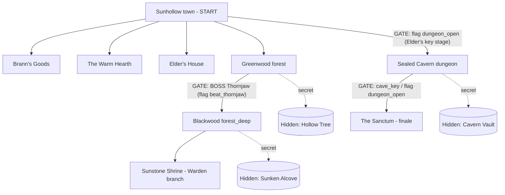

# Sunstone — Progression & Gating Map (design spec / source of truth)

This document is the authoritative plan for the "deeper quests + gated world"
pass. Two workstreams build against it in parallel:

- **Engine (A)** — `dialogue.js`, `overworld.js`, `CONTRACT.md`, `verify.mjs`,
  `smoke.mjs`. Adds the *grammar* this plan needs (dialogue pagination, gated
  transitions). Does NOT touch `data.js`.
- **Content (B)** — `data.js` ONLY. Authors maps, quests, items, dialogue, and
  uses the grammar A provides. Does NOT touch engine/test files or `CONTRACT.md`.

Design goals (from the brief):
1. Side-quest items take real walking / progression — not all clustered.
2. Some quests live in regions blocked by a boss or otherwise unreachable from
   the start.
3. Some quests are offered early but their items are far away.
4. Some quests are multi-step **chains**; some are fast, some are slow.
5. Quest-givers should **not** just hand you items as a reward — **except one**
   who ceremoniously gives you a "super important" artifact that is grand and
   legendary-looking but does **nothing** (no stats, no gold) — a satire of the
   RPG "here, keep this priceless thing" trope.
6. A **few** (very few) hidden rooms that are genuinely hard to find.
7. Long dialogue that overflows the box must be split into successive boxes.

---

## 1. World graph & gating



### Gates to add
| Edge | Gate type | Flag/condition | Blocked dialogue |
|---|---|---|---|
| `forest → forest_deep` | **Boss** (Thornjaw) | `flag:beat_thornjaw` | `gate_thornjaw` (runs `battle:thornjaw`, on win sets `beat_thornjaw`) |
| `town → dungeon` | **Progression** | `flag:dungeon_open` | `gate_cave` ("a sun-sigil seals the cave; the Elder holds its key") |
| `dungeon → sanctum` | existing | `item:cave_key` / `flag:dungeon_open` | existing `dungeon_gate` |

`dungeon_open` is already granted by the Elder (`elder_main → give_key`) after
`flag:path_chosen`. So the cave (and everything in it) becomes mid/late-game.

Net effect on reachability from a fresh start:
- **Early (open):** town interiors, Greenwood forest, Hollow Tree secret.
- **After Thornjaw:** Blackwood, the Shrine, the Sunken Alcove secret.
- **After the Warden branch + Elder's key:** the Sealed Cavern, the Cavern
  Vault secret, the Sanctum.

---

## 2. New engine grammar (built by A, authored by B)

### 2a. Gated transitions (`overworld.js`)
Extend the `transition` trigger with optional gating:
```
{ tx, ty, type:"transition", to, dir,
  requires?: Cond,        // if present and FALSE, the transition does NOT fire
  blocked?:  treeId }     // dialogue to open when blocked (optional)
```
Behavior in `onEnterTile`:
- For a `transition`, if `tr.requires` exists and `evalCond` is false:
  - if `tr.blocked`, `G.openDialogue(tr.blocked)`; else `G.toast("The way is blocked.")`
  - **do not** load the destination map.
- A `blocked` dialogue may itself run a `battle:` and set a flag (boss gate).
  After the player wins and the gate flag is set, stepping onto the tile again
  passes `requires` and transitions normally (tile is non-solid; no re-entry on
  the same tile until the feet-tile changes — that's fine, the player steps off
  and back through the now-open way).
- Losing a `blocked`-dialogue battle already routes to game over (existing
  dialogue.js behavior). No special handling needed.

`verify.mjs`: a gated transition is still physically walkable, so reachability
math is unchanged. Add a check: if a transition has `blocked`, the referenced
dialogue must exist. Keep everything else lenient (no false failures for gates).

### 2b. Dialogue pagination (`dialogue.js`)
The box is fixed height (`boxH = 52`). Long `node.text` currently overflows.
Implement **auto-pagination**:
- After `sprites.wrap(text, maxW)`, compute how many lines fit the box
  (`lineH = 9`, +2 spacing, top pad ~7 → ~3 lines safely; compute it, don't
  hardcode if avoidable).
- Split the wrapped lines into pages of that size. Typewriter reveals the
  current page only.
- `confirm` when a page finishes typing: if more pages remain, go to next page
  (reset reveal); only on the **last** page does `confirm` advance the node /
  reveal choices. Fast-forward on `confirm` mid-type still applies per page.
- The "more" indicator: keep the blinking arrow; it now means "next page" until
  the last page, then "advance" as before.
- Endings (`renderEnding`) are unaffected.

This satisfies goal #7 generically — B does not need to manually split text,
though B should still avoid absurdly long single nodes.

### Constraints for B (content)
- **Reuse existing asset names only** (see CONTRACT.md): enemy sprites,
  portraits, icons, tiles. New enemies must set `sprite` to an existing enemy
  sprite name (e.g. a forest miniboss can reuse `goblin_chief` or `golem`).
  New key items use an existing icon (`star`, `sword`, `scroll`, `key`).
- **Hidden rooms** need NO engine change: place a `transition` trigger on a tile
  that *looks solid* (e.g. `tree`, `rock`, `wall_stone`, `cave_wall`). Transition
  tiles are auto-made walkable, so a "wall" you can walk through = a secret. The
  hidden destination is a small new map with a chest and a return transition.
- Keep maps rectangular (all `rows` equal length) and validated by `verify.mjs`.

---

## 3. Quest plan (authored by B in `data.js`)

### Reward policy
- **Default:** thanks + modest gold. **Remove** the free consumable handouts
  (`give:hi_potion`, `give:elixir`, `give:ether`, `give:phoenix_down`) that quest
  -givers currently dump on you.
- **Powerups** (`powerup`) remain the meaningful reward for the **longest /
  hardest** quests only (this is the core build economy combat was tuned around).
- **Exactly one** quest awards the satirical grand item (below).
- Main-quest starter kit from the Elder (`give:potion:2`, `gold:+40`) stays — it's
  an onboarding kit, not a fetch reward.

### The satirical grand-but-useless item
- New key item, e.g. `grand_relic`:
  `{ id:"grand_relic", name:"Dawnbreaker, Blade of the First Hero", icon:"sword",
     type:"key", price:0, desc:"<grandiose legendary description that lampshades
     that it does absolutely nothing>" }`
- Awarded by **one** quest-giver with full ceremony/fanfare. Because it's
  `type:"key"`, it can't be equipped, sold, or used — it just sits in your bag
  looking important. That's the joke; make the dialogue sell the grandeur.

### Quest table (rework + add)
| Quest | Length | Region(s) / gating | Item placement | Reward |
|---|---|---|---|---|
| `sq_locket` (Mira) | medium | item now in **Blackwood** (post-Thornjaw), moved to a far/hidden corner | spread far from giver | gold only (no item) |
| `sq_medicine` (Oden) | medium | Blackwood deep cache | far | gold only |
| `sq_bounty` (Bram → Thornjaw or a wolf) | fast→medium | Greenwood/Blackwood | boss fight | gold + maybe powerup |
| `sq_poacher` (Garron) | medium, moral branch | Blackwood | n/a (choice) | gold (+powerup on the kind path, as today) |
| `sq_verse` (Wrenna) | **chain** | extend: after reciting, she sends you to a *second* grave (new clue, deeper/gated) before the true reward | two far clues | powerup (long quest) |
| `sq_relics` (Pell) | **slow/long** | 3 ember crystals: Greenwood (early), Blackwood (post-Thornjaw), Sealed Cavern (post-key) — naturally spans the whole game | very spread | powerup |
| `sq_rescue` (Hessa→Tomm) | slow | Sealed Cavern (post-key) | gated late | gold only (no phoenix_down) |
| **NEW** `sq_heirloom` | medium | recover the "legendary" relic from a hidden/gated spot | far/hidden | **the grand-useless `grand_relic`** (satire) |
| (optional) one **fast** quest | fast | inside town/Greenwood | nearby | tiny gold |

Add at least: one fast quest, one multi-step chain (`sq_verse` extension or
similar), and ensure 3 of the quests require crossing a gate. Use existing
quest-gating dialogue patterns (branch on flags/quest status) so quests can't be
soft-locked by talking out of order (the prior `sunmoss` ordering bug pattern).

### Hidden rooms (2–3 total, "very few")
- **Hollow Tree** (off Greenwood, via a `tree` tile transition): early secret,
  real treasure chest (gold or a good consumable found, not given).
- **Sunken Alcove** (off Blackwood, via a `rock` tile transition): a quest clue
  or chain step for `sq_verse`/`sq_heirloom`.
- **Cavern Vault** (off the Sealed Cavern, via a `cave_wall`/`wall_stone`
  transition): late secret, the genuinely good find (e.g. an epic powerup chest
  or large gold), NOT the satirical item (that's a quest reward).

---

## 4. Validation (run by integrator after both streams land)
- `node game/verify.mjs` — reachability green (gates don't break it).
- `node game/smoke.mjs` — all dialogue trees + battles run without errors,
  including new boss-gate dialogues and new quest trees.
- `npx vite build game` — production build passes.
